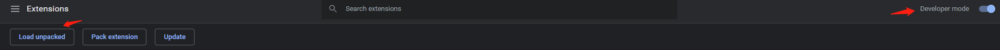

# better-chrome

A Chrome extension to improve user experience and interactions with Google Chrome

## Features

- Open link in new tab 
    - ⚡ shows up when mouse middle button is pressed to open a link in a new tab
    - Right click on a link and select the context menu with the extension icon works the same
    - Click on the icon instead of pressing middle button every time
- Scroll to top button
    - ⏫ appears when scrolling down a relatively lengthy webpage
- Remove Google ads
- Auto pause a video or audio when another starts to play
    - Mute the previous tab playing audio when no audio or video element is found
    - Unmute upon revisiting the muted tab
- Add reminder and get notified
    - Set reminder in "Options" by right clicking the extension icon
    - Support picking date or time countdown

## Installation

1. Download the lastest compressed file in [Release](https://github.com/BGDanny/better-chrome/releases) and extract
2. Open ["chrome://extensions/"](chrome://extensions/) in Google Chrome
3. Enable developer mode on the top right corner
4. Click "load unpacked" on the top left and select the extracted directory

## Note

- Notification has a tolerance of up to 10 seconds
- Keep the options page open to receive reminder notification
## Acknowledgements

Icons made by <a href="https://www.freepik.com" title="Freepik">Freepik</a> from <a href="https://www.flaticon.com/" title="Flaticon">www.flaticon.com</a>

